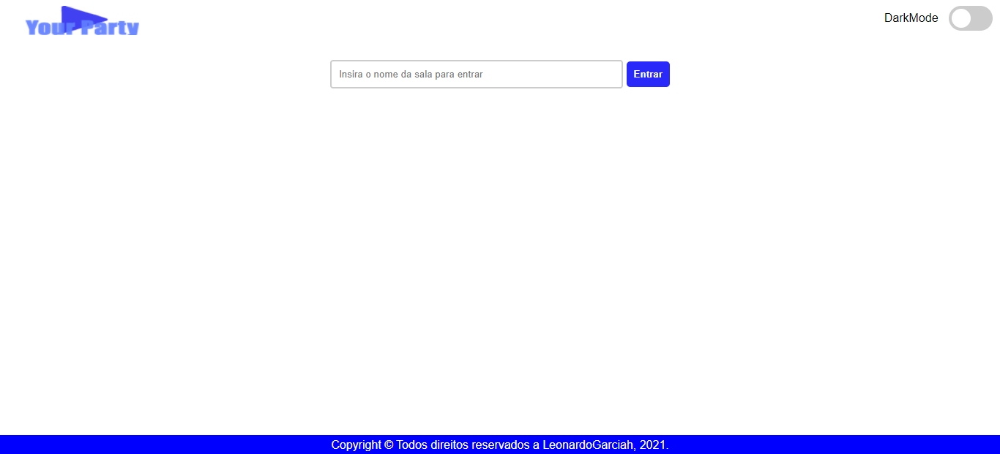
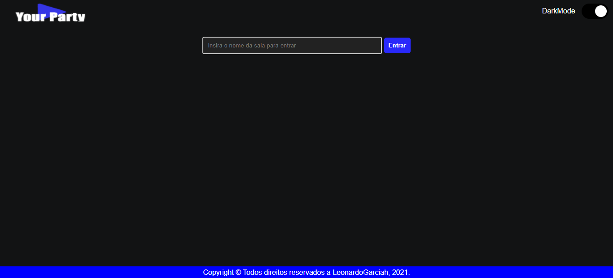
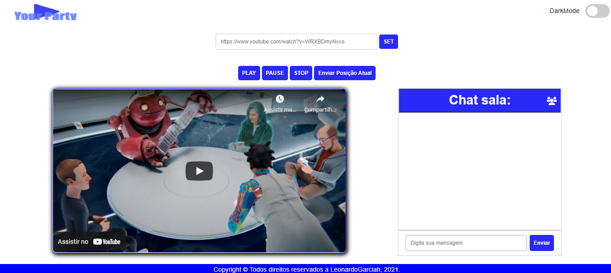
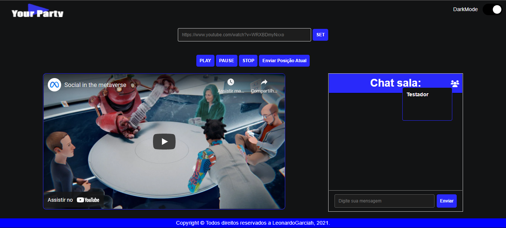

# YourParty-Socket-io
Projeto com intuito de fornecer controle a vídeos do youtube para que possa ser assistido por varias pessoas de forma simultânea  e síncrona, Utilizado NodeJS e Socket.io 

<h2>Entrar na sala - Modo Claro</h2>

<h2>Entrar na sala - Modo Escuro</h2>

<h2>Tela principal - Modo Claro</h2>

<h2>Tela principal - Modo Escuro</h2>

